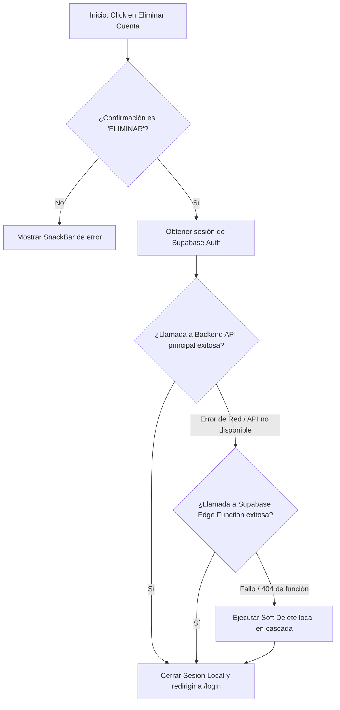

# Guía de Eliminación de Cuenta en Vibeloop
Este documento describe paso a paso el proceso de eliminación de cuenta en la plataforma Vibeloop, desde la interfaz de usuario en la aplicación móvil (Flutter) hasta el procesamiento en el backend y la base de datos (Supabase).

---

## 1. Flujo del Usuario (Aplicación Móvil)

El proceso inicia cuando el usuario decide borrar su cuenta desde los ajustes de la aplicación:

1. **Acceso a la Pantalla**: El usuario navega a la pantalla **"Eliminar cuenta"** (`DeleteAccountScreen`), gestionada en las rutas de la aplicación ([app_router.dart](file:///c:/Users/EMOTIVA1/Desktop/vibeloop/apps/mobile/lib/core/router/app_router.dart)).
2. **Advertencia de Seguridad**: Se muestra una tarjeta informativa con el título **"Salida definitiva"**, advirtiendo al usuario sobre las consecuencias:
   * Cierre automático de sesión en todos los dispositivos.
   * Eliminación de fotos, notificaciones, filtros y bloqueos vinculados a la cuenta.
   * Retiro de membresías de grupos y desactivación/anonimización del perfil.
3. **Confirmación Obligatoria**: Para habilitar la acción, el usuario debe escribir textualmente la palabra **`ELIMINAR`** (en mayúsculas) en un campo de texto de confirmación.
4. **Ejecución**: El usuario presiona el botón **"Eliminar mi cuenta"**. Mientras el proceso está en curso, se muestra un indicador de carga (`CircularProgressIndicator`) y se bloquean las interacciones.

---

## 2. Flujo Lógico en el Cliente (Flutter App)

Cuando el usuario confirma la acción, se ejecuta el método `deleteAccount` dentro de [auth_repository.dart](file:///c:/Users/EMOTIVA1/Desktop/vibeloop/apps/mobile/lib/features/auth/data/auth_repository.dart):

### Detalle del Código del Cliente:
1. **Validación de Sesión**: Se verifica que exista un usuario autenticado activo (`currentUser`).
2. **Intento 1: API REST del Backend (`/functions/v1/delete-account`)**:
   * Envía una petición `POST` al backend con el token de autorización Bearer de la sesión actual y el cuerpo JSON conteniendo `confirmationText: "ELIMINAR"`.
3. **Intento 2: Función de Supabase Edge (Fallback de red)**:
   * Si la API principal del backend falla por problemas de red o conexión (`SocketException`, `HttpException`), la aplicación intenta invocar directamente la función edge de Supabase `delete-account`.
4. **Intento 3: Soft Delete Local (Plan de contingencia)**:
   * Si el servidor responde con un error `404` (función no encontrada o desactivada), la app ejecuta `_softDeleteCurrentAccount(user)` de manera directa contra la base de datos Supabase con los permisos de usuario actuales, realizando una limpieza en el mejor esfuerzo ("best-effort").
5. **Cierre de Sesión Local**: Finalmente, tras completarse con éxito cualquiera de los métodos anteriores, el cliente ejecuta `signOut()` de Supabase local y redirige a la pantalla `/login`.

---

## 3. Flujo en el Backend (Supabase Edge Function / Servidor)

Cuando la solicitud llega exitosamente al backend ([server.mjs](file:///c:/Users/EMOTIVA1/Desktop/vibeloop/apps/backend/server.mjs) -> `handleDeleteAccount`), se realizan las siguientes acciones administrativas con altos privilegios (`serviceRoleKey`):

### Paso 3.1: Validaciones de Seguridad
* Se comprueba que el cuerpo tenga el parámetro `confirmationText` exactamente igual a `ELIMINAR`.
* Se valida la autenticidad del token Bearer del usuario haciendo una petición interna a Supabase Auth (`/auth/v1/user`). Si no es válido, retorna `401 Unauthorized`.

### Paso 3.2: Identificación de Recursos y Archivos
* **Fotos de Grupo**: Se consulta la tabla `group_photos` para obtener todas las rutas de almacenamiento (`storage_path`) de las fotos subidas por este usuario.
* **Avatares**: Se listan todos los archivos de imagen en el bucket `avatars` que tengan el prefijo del ID del usuario (`userId/*`).

### Paso 3.3: Eliminación de Datos Relacionales (Base de Datos)
Se borra en paralelo toda la información asociada al usuario en las siguientes tablas de Supabase:
1. **`user_hidden_words`**: Palabras ocultas por el usuario.
2. **`user_blocked_users`**: Lista de usuarios bloqueados.
3. **`user_message_filter_settings`**: Configuración de filtros de mensajería.
4. **`notifications`**: Notificaciones enviadas/recibidas por el usuario.
5. **`reactions`**: Reacciones de contenido (likes, emojis) realizadas por el usuario.
6. **`group_members`**: Salida de todos los grupos a los que pertenece.
7. **`group_photos`**: Registros en la base de datos de las fotos que el usuario subió.

### Paso 3.4: Anonimización de la Cuenta (`users` table)
Para mantener la integridad histórica de los chats y la consistencia de los grupos sin corromper la experiencia de otros miembros, el registro del usuario en la tabla pública `users` no se borra, sino que se anonimiza mediante una actualización (`PATCH`):
* `username` se cambia a `deleted_<primeros_8_caracteres_del_id_usuario>`.
* `display_name` pasa a ser `"Cuenta eliminada"`.
* `avatar_url` se limpia a `null`.
* `emoji` de estado se reinicia a `🙂`.

### Paso 3.5: Eliminación Física en Almacenamiento (Storage Buckets)
* Se eliminan físicamente los archivos del bucket `group-photos` asociados a las rutas de las imágenes subidas por el usuario.
* Se eliminan físicamente los avatares personales del bucket `avatars` del usuario.

### Paso 3.6: Eliminación Definitiva en Supabase Auth
* Finalmente, utilizando el API de administración (`/auth/v1/admin/users/<userId>`) y la llave de rol de servicio (`serviceRoleKey`), se elimina permanentemente el usuario del registro de autenticación de Supabase. Esto impide cualquier inicio de sesión futuro y borra sus credenciales de manera irreversible.
* El servidor retorna `{ "success": true }`.

---

## Resumen de Tablas Afectadas

| Tabla / Recurso | Acción Realizada | Propósito |
| :--- | :--- | :--- |
| `user_hidden_words` | `DELETE` | Elimina palabras filtradas. |
| `user_blocked_users` | `DELETE` | Elimina la lista de usuarios bloqueados. |
| `user_message_filter_settings` | `DELETE` | Elimina configuración de filtros. |
| `notifications` | `DELETE` | Elimina notificaciones. |
| `reactions` | `DELETE` | Elimina reacciones dadas. |
| `group_members` | `DELETE` | Retira al usuario de los grupos. |
| `group_photos` (DB) | `DELETE` | Elimina registros de fotos de grupos subidas. |
| `group-photos` (Bucket) | `DELETE` (Físico) | Elimina archivos de fotos de grupos del storage. |
| `avatars` (Bucket) | `DELETE` (Físico) | Elimina archivos de avatars del storage. |
| `users` (DB) | `PATCH` (Update) | Anonimiza el nombre y limpia el avatar/emoji. |
| `Supabase Auth Users` | `DELETE` (Admin) | Remueve credenciales de autenticación permanentemente. |
